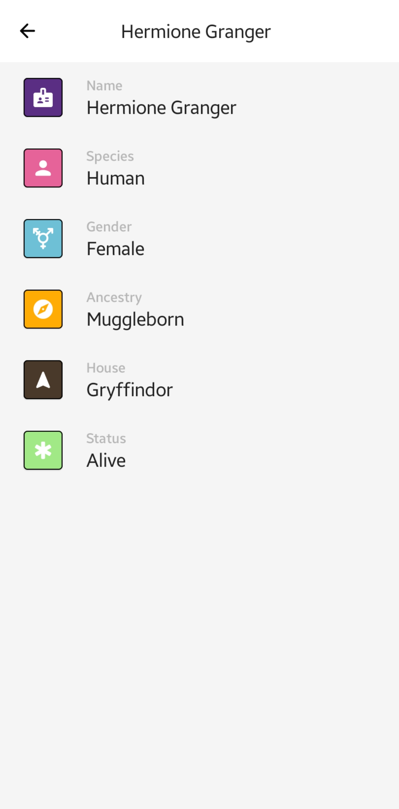

# Voldemort
## Description
A simple, well-modularized app that fetches data from the Harry Potter API, built with standard abstraction from the data layer to UI layer.

You can find the apk [here](apk/voldemort.apk)

## Screenshots
| Character | Search Character | Character Details | Character Details Expanded |
|:-----:|:-----:|:-----|:-----|
|||||

## Testing :test_tube:
| MODULE | TESTS |
|:----:|:-----:|
| `:remote` |  |
| `:local` |  |
| `:data` |  |
| `:domain` |  |

